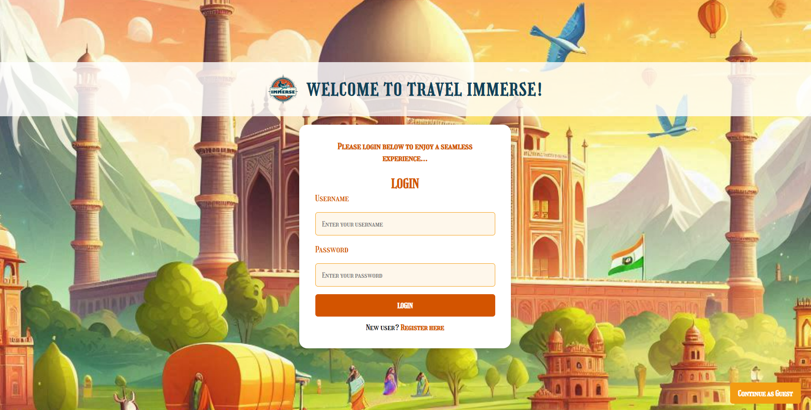
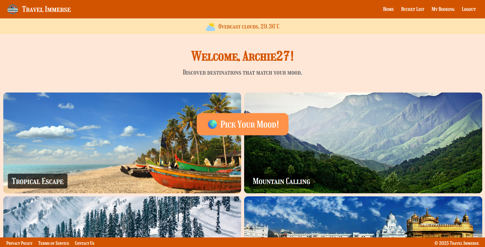
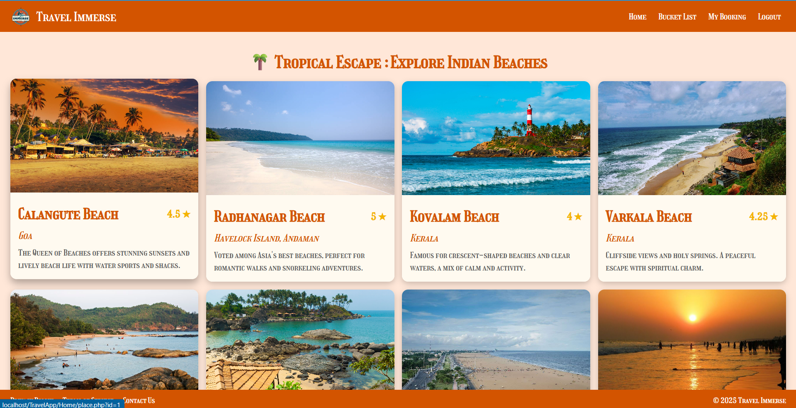
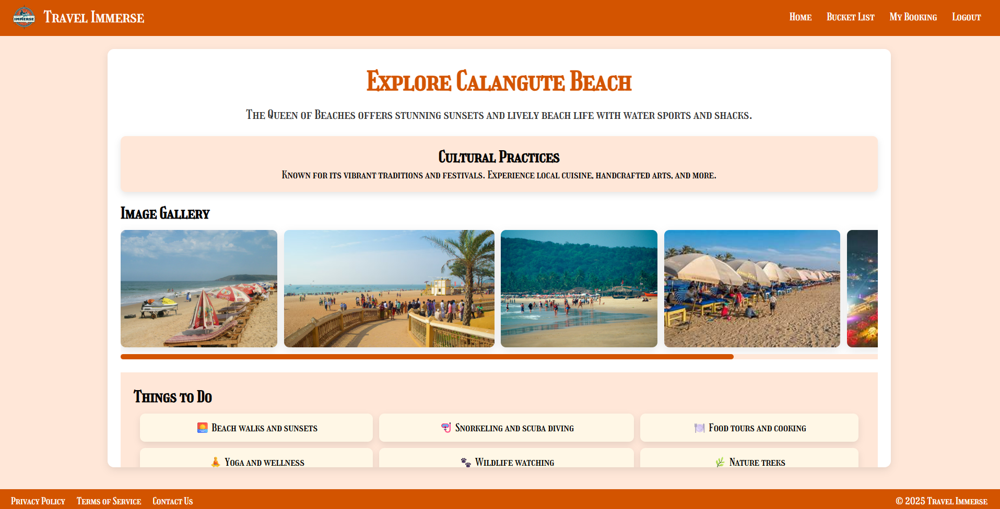

  

<h1 align="center">🌍 Travel Immerse – Your Journey, Simplified!</h1>
 

  
  
  
  
  

Travel Immerse is an **all-in-one travel service platform for India**, designed to make trip planning seamless, immersive, and enjoyable. From destination discovery to resort booking, restaurant recommendations, guides, and travel arrangements – everything is available in one place.  

---

## ✨ Features  

- 🔑 **User Authentication**: Login, registration, and guest access.  
- 🏠 **Homepage**: Mood-based travel themes with real-time weather.  
- 📍 **Location Explorer**: Browse destinations with images, ratings, and cultural highlights.  
- 🏖️ **Place Information Page**: Comprehensive details including things to do, famous spots, transport options, resorts, and guides.  
- 🏨 **Resort Booking**: Browse resorts, view prices, and book stays.  
- 🍴 **Restaurant Booking**: Discover and reserve restaurants with popular dishes and seasonal offers.  
- 🚌 **How to Reach**: Multiple transport options (flights, trains, road).  
- 🧑‍🤝‍🧑 **Tourist Guides**: Book local guides with ratings, experience, and pricing.  
- 📝 **Review System**: Upload text and images to share travel experiences.  
- 💳 **Payment & Tickets**: Booking confirmation with ticket generation (PDF/email).  

---

## 🖼️ Screenshots  

### 🔑 Login & Registration  
  

### 🏠 Homepage  
  

### 📍 Location Page  
  

### 📝 Place Details Section  
  

---

## 🛠️ Tech Stack  

**Frontend:**  
- HTML5  
- CSS3  
- JavaScript  

**Backend:**  
- PHP  

**Database:**  
- MySQL  

---

## 🧑‍💻 Target Users  

- 🌐 Tech-savvy Millennials & Gen Z travelers  
- 👨‍👩‍👧 Families and solo travelers  
- 🎭 Culturally curious explorers  
- 💸 Budget-conscious travelers  
- 🏨 Local businesses (hotels, restaurants, guides)  

---
